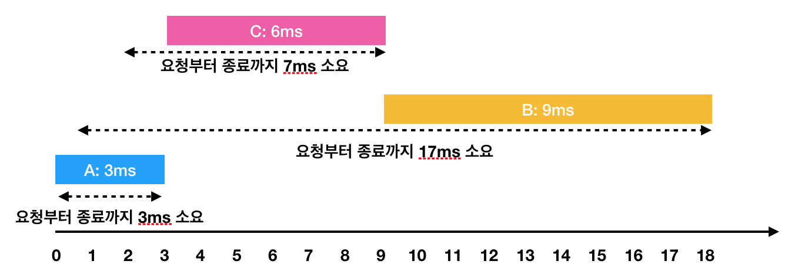

# 힙(Heap) > 디스크 컨트롤러 (Level 3)
문제 : https://programmers.co.kr/learn/courses/30/lessons/42627

## 문제 설명
하드디스크는 한 번에 하나의 작업만 수행할 수 있습니다. 디스크 컨트롤러를 구현하는 방법은 여러 가지가 있습니다. 가장 일반적인 방법은 요청이 들어온 순서대로 처리하는 것입니다.

예를들어

    - 0ms 시점에 3ms가 소요되는 A작업 요청
    - 1ms 시점에 9ms가 소요되는 B작업 요청
    - 2ms 시점에 6ms가 소요되는 C작업 요청
    
와 같은 요청이 들어왔습니다. 이를 그림으로 표현하면 아래와 같습니다.


한 번에 하나의 요청만을 수행할 수 있기 때문에 각각의 작업을 요청받은 순서대로 처리하면 다음과 같이 처리 됩니다.


    - A: 3ms 시점에 작업 완료 (요청에서 종료까지 : 3ms)
    - B: 1ms부터 대기하다가, 3ms 시점에 작업을 시작해서 12ms 시점에 작업 완료(요청에서 종료까지 : 11ms)
    - C: 2ms부터 대기하다가, 12ms 시점에 작업을 시작해서 18ms 시점에 작업 완료(요청에서 종료까지 : 16ms)

이 때 각 작업의 요청부터 종료까지 걸린 시간의 평균은 10ms(= (3 + 11 + 16) / 3)가 됩니다.

하지만 A → C → B 순서대로 처리하면



    - A: 3ms 시점에 작업 완료(요청에서 종료까지 : 3ms)
    - C: 2ms부터 대기하다가, 3ms 시점에 작업을 시작해서 9ms 시점에 작업 완료(요청에서 종료까지 : 7ms)
    - B: 1ms부터 대기하다가, 9ms 시점에 작업을 시작해서 18ms 시점에 작업 완료(요청에서 종료까지 : 17ms)

이렇게 A → C → B의 순서로 처리하면 각 작업의 요청부터 종료까지 걸린 시간의 평균은 9ms(= (3 + 7 + 17) / 3)가 됩니다.

각 작업에 대해 [작업이 요청되는 시점, 작업의 소요시간]을 담은 2차원 배열 jobs가 매개변수로 주어질 때, 작업의 요청부터 종료까지 걸린 시간의 평균을 가장 줄이는 방법으로 처리하면 평균이 얼마가 되는지 return 하도록 solution 함수를 작성해주세요. (단, 소수점 이하의 수는 버립니다)

## 제한사항
- jobs의 길이는 1 이상 500 이하입니다.
- jobs의 각 행은 하나의 작업에 대한 [작업이 요청되는 시점, 작업의 소요시간] 입니다.
- 각 작업에 대해 작업이 요청되는 시간은 0 이상 1,000 이하입니다.
- 각 작업에 대해 작업의 소요시간은 1 이상 1,000 이하입니다.
- 하드디스크가 작업을 수행하고 있지 않을 때에는 먼저 요청이 들어온 작업부터 처리합니다.

## 입출력 예

| jobs | return |
| --- | --- | 
| [[0, 3], [1, 9], [2, 6]] | 9 |

____

> #### < Code : Python >
```python
import heapq

def solution_Disk(jobs):
    answer, now, processed_request, N = 0, 0, 0, len(jobs)
    wait = []
    jobs.sort()
    while processed_request < N :
        while jobs and jobs[0][0] <= now:
            request = jobs.pop(0)
            answer += (now - request[0])
            heapq.heappush(wait, request[1])

        if wait:
            answer += len(wait) * wait[0]
            now += heapq.heappop(wait)
            processed_request += 1
        else:
            now += 1
    return answer // N
```

## 문제 리뷰
- 문제에서 말하는 스케줄링 방식은 FCFS 스케줄링 방식이 아닌 `SJF 스케줄링` 방식 (비선점 스케줄링)
- 요청받은 작업을 수행가능 한 시점 now, 처리된 요청의 개수를 세는 processed_request
- 우선 jobs를 정렬시켜 요청 시점이 빠른 작업이 앞으로 올 수 있도록 한다.
- 요청 시점이 빠른 작업이 앞쪽에 위치했기 때문에, jobs[0][0]이 가장 먼저 요청된 작업이다.
- `(( 반복 ))`
- now 시점 전에 요청된 작업은 모두 heap에 넣어주고, 요청된 시점에서부터 now시점 까지 대기하였기 때문에 대기한 만큼 answer에 추가해준다.
- 대기 중인 프로세스들은 한 프로세스가 실행되는 동안 그 프로세스가 실행되는 시간만큼 대기하므로, (wait에 들어가 있는 프로세스 개수 * 실행되는 프로세스 실행시간) 만큼을 answer에 추가해준다.
- now 시점에 실행 시간 만큼 더해준다. (대기열에 있는 작업이 없으면 now시점만 +1)
- `(( 반복 ))`