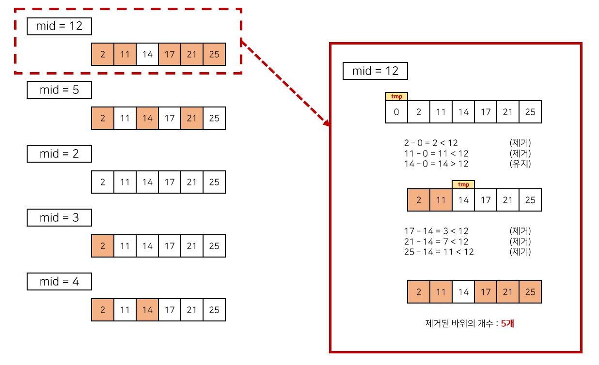

# 이분탐색 > 징검다리 (Level 4)
문제 : https://programmers.co.kr/learn/courses/30/lessons/43236

## 문제 설명
출발지점부터 distance만큼 떨어진 곳에 도착지점이 있습니다. 그리고 그사이에는 바위들이 놓여있습니다. 바위 중 몇 개를 제거하려고 합니다.

예를 들어, 도착지점이 25만큼 떨어져 있고, 바위가 [2, 14, 11, 21, 17] 지점에 놓여있을 때 바위 2개를 제거하면 출발지점, 도착지점, 바위 간의 거리가 아래와 같습니다.

| 제거한 바위의 위치 | 각 바위 사이의 거리 | 거리의 최솟값 |
|---|---|---|
| [21, 17] | [2, 9, 3, 11] | 2 |
| [2, 21] | [11, 3, 3, 8] | 3 |
| [2, 11] | [14, 3, 4, 4] | 3 |
| [11, 21] | [2, 12, 3, 8] | 2 |
| [2, 14] | [11, 6, 4, 4] | 4 |

위에서 구한 거리의 최솟값 중에 가장 큰 값은 4입니다.

출발지점부터 도착지점까지의 거리 distance, 바위들이 있는 위치를 담은 배열 rocks, 제거할 바위의 수 n이 매개변수로 주어질 때, 바위를 n개 제거한 뒤 각 지점 사이의 거리의 최솟값 중에 가장 큰 값을 return 하도록 solution 함수를 작성해주세요.

## 제한사항
- 도착지점까지의 거리 distance는 1 이상 1,000,000,000 이하입니다.
- 바위는 1개 이상 50,000개 이하가 있습니다.
- n 은 1 이상 `바위의 개수` 이하입니다.

## 입출력 예

| distance | rocks | n | return |
| --- | --- | --- | --- |
| 25 | [2, 14, 11, 21, 17] | 2 | 4 | 

____

> #### < Code : Python >
```python
def solution(distance, rocks, n):
    rocks.append(distance)
    rocks.sort()
    
    left, right = 0, distance
    while left <= right:
        mid = (left + right) // 2
        count, tmp = 0, 0
        min_dist = distance
        for rock in rocks:
            if rock - tmp >= mid:
                min_dist = min(min_dist, rock - tmp)
                tmp = rock
            else:
                count += 1

        if count > n:
            right = mid -1
        else:
            answer = min_dist
            left = mid + 1

    return answer
```

## 문제 리뷰
- 일일이 순열 조합을 이용해 모든 경우에 대한 연산을 수행하면 시간 초과 예상.
- `이진 탐색`을 이용해 시간 단축.
- 바위 간 거리를 이진 탐색의 대상으로 정하여 현재 위치(tmp)에서 바위까지의 거리가 `제거 기준(mid)`보다 작으면 해당 바위를 제거, 그렇지 않으면 유지하는 방식이다.
- 이 과정에서 제거된 바위의 수와 바위 간 거리의 최소값을 저장하고, 제거된 바위의 수가 n보다 크면 right를 mid-1로 바꿔주고, 그렇지 않으면 left를 mid+1로 바꿔주어 제거 기준(mid)을 이진 탐색의 방법으로 변경해준다.
- 이 과정을 left가 right보다 커지기 전까지 반복 수행하면 바위 간 거리 최솟값의 최대값을 구할 수 있다. 
- 다음은 문제에 나온 예시에 대한 이진 탐색 과정이다. 

