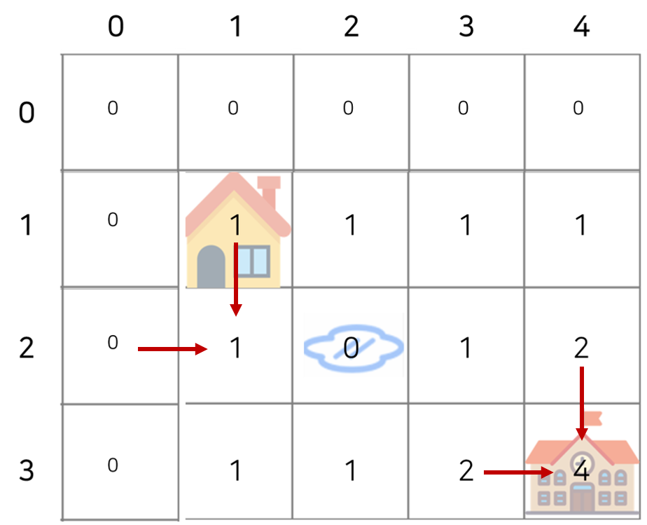

# 동적계획법(Dynamic Programming) > 등굣길 (Level 3)
문제 : https://programmers.co.kr/learn/courses/30/lessons/42898

## 문제 설명
계속되는 폭우로 일부 지역이 물에 잠겼습니다. 물에 잠기지 않은 지역을 통해 학교를 가려고 합니다. 집에서 학교까지 가는 길은 m x n 크기의 격자모양으로 나타낼 수 있습니다.

아래 그림은 m = 4, n = 3 인 경우입니다.


가장 왼쪽 위, 즉 집이 있는 곳의 좌표는 (1, 1)로 나타내고 가장 오른쪽 아래, 즉 학교가 있는 곳의 좌표는 (m, n)으로 나타냅니다.

격자의 크기 m, n과 물이 잠긴 지역의 좌표를 담은 2차원 배열 puddles이 매개변수로 주어집니다. 오른쪽과 아래쪽으로만 움직여 집에서 학교까지 갈 수 있는 최단경로의 개수를 1,000,000,007로 나눈 나머지를 return 하도록 solution 함수를 작성해주세요.

## 제한사항
- 격자의 크기 m, n은 1 이상 100 이하인 자연수입니다.
    - m과 n이 모두 1인 경우는 입력으로 주어지지 않습니다.
- 물에 잠긴 지역은 0개 이상 10개 이하입니다.
- 집과 학교가 물에 잠긴 경우는 입력으로 주어지지 않습니다.

## 입출력 예

| m | n | puddles | return |
| --- | --- | --- | --- |
| 4 | 3 | [[2, 2]] | 4 |

____

> #### < Code : Python >
```python
def solution(m, n, puddles):
    maps = [[0 for _ in range(m+1)] for _ in range(n+1)]
    maps[1][1] = 1
    
    for y in range(1, n+1):
        for x in range(1, m+1):
            if [x, y] == [1, 1]:
                continue
            if [x, y] in puddles:
                continue
            else:
                maps[y][x] = maps[y-1][x] + maps[y][x-1]
                
    return maps[n][m] % 1000000007
```

## 문제 리뷰



- 중학교 때, 최단 거리를 찾는 문제에서 사용하던 방법에서 착안한 방법이다.
- 오른쪽과 아래쪽 방향으로만 이동할 수 있으므로, 어떠한 지점에 가기 위한 최단 경로의 수는 (해당 지점 바로 윗 지점까지 최단 경로의 수) + (해당 지점 바로 왼쪽 지점까지 최단 경로의 수) 이다.
- 계산을 위해 n x m 2차 리스트를 만들어줘야하는데, 문제의 조건 사항들을 위해 편의상 (n+1) x (m+1) 로 만들어준다.
- 이중 포문을 이용해 진행하면서 도착 지점까지의 모든 지점의 최단 경로를 구해준다.
- 이때, 물에 잠긴 지역(puddles)은 지나갈 수 없으므로 0으로 세팅하여 계산한다.

___
___
#### 시행착오
```python
# 시행착오 1 (테스트 8,10 & 효율성 전부 탈락)
from collections import Counter

def solution1(m, n, puddles):
    puddles = [tuple(puddle) for puddle in puddles]
    home, school = (1, 1), (m, n)
    right, down = (1, 0) , (0, 1)
    
    routes = [home]
    while school not in routes:
        tmp = []
        for point in routes:
            right_step = tuple(sum(x) for x in zip(point, right))
            down_step = tuple(sum(y) for y in zip(point, down))
            if right_step[0] <= m and right_step not in puddles:
                tmp.append(right_step)
            if down_step[1] <= n and down_step not in puddles:
                tmp.append(down_step)
        routes = tmp[:]

    answer = Counter(routes)[school]
    return answer % 1000000007
```

튜플 형태의 좌표로서 점차적인 오른쪽, 아래 방향 전진을 통해 학교(school)에 도착한 경우가 생겼을 때, 최단 경로로 학교에 도착한 경로의 수를 세는 방법을 이용하였다. 이 과정에서 puddles와 home, school 좌표 도 모두 튜플로 변환하였고, 한 턴마다 route에 있는 point들에 (1,0), (0,1)을 각각 덧셈 연산 수행하여 도착 지점까지 진행한다. 이 과정에서 m x n 크기 안을 벗어나거나 웅덩이를 밟는 경우를 제외시킨다. 각 턴이 끝나면 학교에 도착한 경로가 있는지 확인하였고, 도착하면 while문을 빠져나가 최단 경로의 수를 count 하였다.

하지만 두가지 테스트 케이스에서 시간 초과되었고, 효율성 또한 실패하였다. 아마도 계속해서 조건문을 수행하고 반복적인 연산을 통해 시간 초과가 이루어진 것으로 판단하여 방법을 수정하였다.

```python
# 시행착오 2 (효율성 전부 실패)
import numpy as np
def solution2(m, n, puddles):
    maps = np.zeros((n+1, m+1))
    maps[1][1] = 1
    
    for y in range(1, n+1):
        for x in range(1, m+1):
            if [x, y] == [1, 1]:
                continue
            if [x, y] in puddles:
                continue
            else:
                maps[y][x] = maps[y-1][x] + maps[y][x-1]
    return maps[n][m] % 1000000007
```

maps를 구성하는 과정에서 numpy의 zeros 함수를 이용하여 2차원 행렬을 구성하였는데, 정확성 테스트는 모두 통과하였지만 효율성 테스트에서 모두 실패하였다. 이는 직접 2차원 리스트를 구성하여 해결하였다.