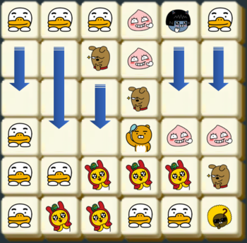

# 2018 KAKAO BLIND RECRUITMENT > [1차] 프렌즈4블록 (Level 2)
문제 : https://programmers.co.kr/learn/courses/30/lessons/17679

## 문제 설명
블라인드 공채를 통과한 신입 사원 라이언은 신규 게임 개발 업무를 맡게 되었다. 이번에 출시할 게임 제목은 프렌즈4블록. 같은 모양의 카카오프렌즈 블록이 2×2 형태로 4개가 붙어있을 경우 사라지면서 점수를 얻는 게임이다.


만약 판이 위와 같이 주어질 경우, 라이언이 2×2로 배치된 7개 블록과 콘이 2×2로 배치된 4개 블록이 지워진다. 같은 블록은 여러 2×2에 포함될 수 있으며, 지워지는 조건에 만족하는 2×2 모양이 여러 개 있다면 한꺼번에 지워진다.



블록이 지워진 후에 위에 있는 블록이 아래로 떨어져 빈 공간을 채우게 된다.


만약 빈 공간을 채운 후에 다시 2×2 형태로 같은 모양의 블록이 모이면 다시 지워지고 떨어지고를 반복하게 된다.


위 초기 배치를 문자로 표시하면 아래와 같다.

    TTTANT
    RRFACC
    RRRFCC
    TRRRAA
    TTMMMF
    TMMTTJ
각 문자는 라이언(R), 무지(M), 어피치(A), 프로도(F), 네오(N), 튜브(T), 제이지(J), 콘(C)을 의미한다

입력으로 블록의 첫 배치가 주어졌을 때, 지워지는 블록은 모두 몇 개인지 판단하는 프로그램을 제작하라.

## 입력 형식
- 입력으로 판의 높이 m, 폭 n과 판의 배치 정보 board가 들어온다.
- 2 ≦ n, m ≦ 30
- board는 길이 n인 문자열 m개의 배열로 주어진다. 블록을 나타내는 문자는 대문자 A에서 Z가 사용된다.

## 출력 형식
입력으로 주어진 판 정보를 가지고 몇 개의 블록이 지워질지 출력하라.

## 입출력 예

| m | n | board | answer |
| --- | --- | --- | --- |
| 4 | 5 | ["CCBDE", "AAADE", "AAABF", "CCBBF"] | 14 |
| 6 | 6 | ["TTTANT", "RRFACC", "RRRFCC", "TRRRAA", "TTMMMF", "TMMTTJ"] | 15 |

____

> #### < Code : Python >
```python
def solution_4Block(m, n, board):
    answer = 0
    board_list = [list() for i in range(n)]
    for puzzle in board[::-1]:
        for p in range(n):
            board_list[p].append(puzzle[p])
    count = 1
    while count:
        count = 0
        index_set = set()
        for i in range(n):
            for j in range(m):
                tmp = board_list[i][j]
                if tmp:
                    if (i+1 < n and j+1 < m) and (board_list[i][j+1] == tmp and board_list[i+1][j] == tmp and board_list[i+1][j+1] == tmp):
                        index_set.add((i,j))
                        index_set.add((i,j+1))
                        index_set.add((i+1,j))
                        index_set.add((i+1,j+1))
        count = len(index_set)
        answer += count
        if count:
            for i, j in index_set:
                board_list[i][j] = 0
            for i, j in index_set:
                board_list[i].remove(0)
                board_list[i].append(0)
    return answer
```

## 문제 리뷰
- 입력으로 들어오는 블록배열은 행(가로) 기준 블록들의 집합.
- 블록이 사라지면 밑으로 떨어져야 하는 구조이므로, 해당 블록을 없앴을 때 자동적으로 뒤에 있던 블록이 앞으로 땡겨지는 것이 좋음.
- 행끼리 묶여있던 블록을 열(세로) 기준으로 재 집합. (이때, 가장 밑에있는 블록이 앞으로 오도록)
- ** 하나의 블록을 기준으로 우측, 하단, 우측 하단 블록이 모두 같다면 해당 블록들의 좌표를 튜플 형태로 집합(중복제거)에 넣어 제거대상인 모든 블록들을 찾아냄.
- ** 집합의 갯수를 세서 제거된 블록의 개수를 센 뒤, 집합 안에 있던 튜플들의 인덱스에 해당하는 블록을 제거. 제거된 블록 뒤에 있던 블록이 앞으로 땡겨지고, 제거된 만큼 맨 뒤에 0을 채워줌.
- 제거되는 블록이 없을 때 까지 ** 과정을 반복.